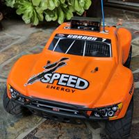

#  Project Anaranjado - Self Driving RC Car
This is my personal project to add autonomous capabilities to an RC Car. "On-Uh-Ron-Ha-Doe" is Spanish for _orange_.

## The Car

* A Traxxas Slash 2wd
* Hall effect quadrature encoded wheel sensors
* Stereo camera
* Teensy 3.5
* Rasberry PI Model 3
* MPU-9250 IMU
* LED Display

## Software

The code is primarily in C++.  I originally tried doing the high level logic in Python, but found C++ was a better fit.

UI, image processing, path recording and following are handled by the Rasberry PI. You can find the Raspbery Pi code in the `cpp` folder.

The Teensy microcontroller communicates with the ESC, servo, IMU and quadrature encoders.  The microcontroller code is in the `teensy` folder.

Desktop software for offline analysis and visualization use QT and is in the `cpp/car-gui` folder.
