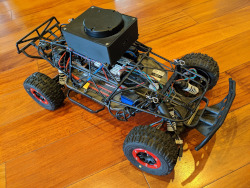

#  Orange Crash - Self Driving RC Car
This is my personal project to add autonomous capabilities RC cars.

## The Cars

<table >
<tr><td style='vertical-align:top'>

**Orange Crash**


* A Traxxas Slash 2wd
* Sensored motor
* ELP 1.0 Stereo camera
* Rasberry PI Model 4
* Hall effect quadrature encoded front wheel sensors
* Teensy 3.2
* MPU-9250 IMU
</td>
<td style='vertical-align:top'>

**Blue Crash**



* A Traxxas Slash 2wd
* Sensored motor
* Neato Lidar
* Rasberry PI Model 3
* Hall effect quadrature encoded front wheel sensors
* Teensy 3.5
* MPU-9150 IMU
* Tough looking roll cage

</td></tr>
</table>

## Software

<image style="float:right" src="docs/media/browser-screenshot-thumbnail.jpg"></img>
The cars expose web servers, and the main control is through a web application using a mixture of Nginx, Flask, and AngularJS.

UI, image processing, path recording and following are handled by the Rasberry PI. The server logic is primarily in C++.  I originally tried doing the high level logic in Python, but found C++ was a better fit. You can find the Raspbery Pi code in the [cpp](cpp) folder.

The Teensy microcontroller communicates with the ESC, servo, IMU and quadrature encoders.  The microcontroller code is in the [teensy](teensy) folder.

## Hardware
Raspberry PI 4


## Raspberry PI Setup
1. Start with a new Raspberry Pi 4 w/4GB RAM and a Samsung EVO Plus 32GB SD Card
1. Download and Raspbian Buster Lite image (released 2019-09-26)from https://www.raspberrypi.org/downloads/raspbian
1. Use Balena Etcher to extract the Raspian image onto the SD card
1. Before placing in Pi, mount the card (click mount button next to boot in explorer) and create the file ssh in the boot folder
    ```bash
    touch /media/$USER/boot/ssh
    ```
1. Eject and remove SD card from PC
1. Insert SD card, connect PI to your router with an Ethernet cable
1. Plug USB3 power into the PI to boot it
1. Find the Pi IP address by going to your router, in my case I go to http://192.168.1.1/ and connected devices are shown in "My Network"
1.  SSH into the Pi
    ```bash
    ssh pi@{ip_address} # the password is raspberry
    ```
1. To SSH without a password, on your Host PC, execute "ssh-keygen" then copy the contents of your Host PC's ~/.ssh/id_rsa.pub into file ~/.ssh/authorized_keys on the Pi.
1. In the Pi SSH session, launch raspi-config
    ```bash
    sudo raspi-config
    ```
    Use the raspi-config menu system to configure the hostname (for me it's orange-crash), timezone, configure the SSID and password to connect to WiFi router, finally, expand the file system to take up all of th 32GB on your SD card. Save and reboot.
1. SSH into the Pi, you should no longer need to use your password.
1. On the PI, create an SSH key to use with GitHub
    ```bash
    ssh-keygen -t rsa -b 4096 -C "{your email}"
    ```
    On GitHub, authorize your pi user by copying the contents of the Pis .ssh/id_rsa.pub to an authorized key
1. Disable swap on Pi. You don't need it and you can avoid corrupting your flash.
    ```bash
    sudo systemctl disable dphys-swapfile.service
    ```
1. Install a few things on the Pi
    ```
    sudo apt install ffmpeg vlc streamer git libncurses5-dev screen nginx fdfind

    ```
1. Set which robot you are working on, add this to .bashrc
    ```
    export ROBOT=orange # current valid values are orange or blue
    ```

1. Clone this repo
    ```bash
    git clone git@github.com:berickson/car.git
    ```
1. install eigen 3.? library into /home/pi/eigen3/Eigen, maybe also into cpp folder?
1. Install and config Python Anaconda (miniconda)
    ```
    wget http://repo.continuum.io/miniconda/Miniconda3-latest-Linux-armv7l.sh
    sudo /bin/bash Miniconda3-latest-Linux-armv7l.sh
    # notes: install to /home/pi/miniconda3

    conda config --add channels rpi
    conda create --name car python=3.5

    source activate car

    pip install pandas dateutil pytz --force-reinstall --upgrade
    pip install flask
    pip install psutil platformio
   
    ```
1. Set up your 49-teensy-rules
    ```
    sudo su
    cd /etc/udev/rules.d
    wget https://www.pjrc.com/teensy/49-teensy.rules
    exit
    ```
    Add the following line to the end of 49-teensy.rules
    ```
    # added by brian, adds symlink /dev/teensy4317960 to read coms
    ATTRS{idVendor}=="16c0", , ATTRS{idProduct}=="04[789B]?", MODE:="0777",SYMLINK+="teensy$attr{serial}",GROUP="users"
    ```
1. Download and compile OpenCV (this will take a while)
    ```bash
    cd car
    bash ./cv3_install.sh
    ```
